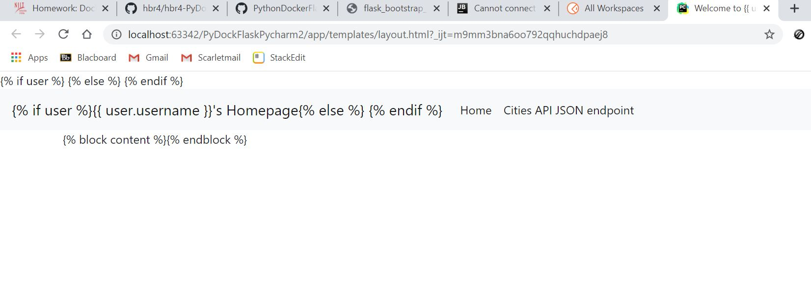

## Setting up Docker, Flask, Python and MySQL with PyCharm
In this assignment, we looked at the integration between PyCharm and MySQL. The professor's guide was however as in the last assignment, I was unable to connect to the database. Despite several trouble shooting effors, the solution still persisted, yet worked on a colleague's computer.

The Dockerfile and Docker compose file was able to run as expected, and deployed successfully]

Due to the database unable to load on my computer, the website was showing errors as well and not loading the data.

However, using the Kinematic Alpha application, I was able to see the container in which the web application was running. Based on this image, it is clear the I am able to reach the end code, however for whatever reason, the database is unable to connect on my machine.

Refer to the below results from Postman
